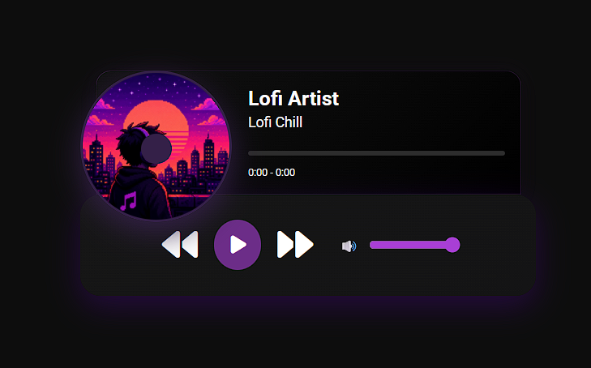

# 🎧 Music Player

Mini player de música desenvolvido com HTML, CSS e JavaScript puro.

---

## 🇧🇷 Sobre o projeto

Este projeto simula um player de música com interface moderna, inspirado em players como Spotify.

Foi criado com foco em prática de:
- Manipulação do DOM
- Eventos em JavaScript
- Controle de áudio
- Interface responsiva

---

## 🇺🇸 About the project

This project is a simple music player built with pure HTML, CSS, and JavaScript.

It simulates a modern music player inspired by platforms like Spotify.

It was created to practice:
- DOM manipulation
- JavaScript events
- Audio control
- Responsive UI design

---

## 🎯 Funcionalidades / Features

- ▶️ Play / Pause
- ⏭ Próxima e anterior música / Next and previous track
- 📊 Barra de progresso interativa / Interactive progress bar
- ⏱ Tempo da música / Song time display
- 💿 Animação do disco / Rotating disc animation
- 🔊 Controle de volume / Volume control

---

## 🛠️ Tecnologias / Technologies

- HTML5
- CSS3
- JavaScript (ES6)
- Font Awesome

---

## 👨‍💻 Autor / Author: Matheus Silva

Projeto desenvolvido para aprendizado e portfólio.  
Project created for learning and portfolio purposes.

## 📸 Preview

